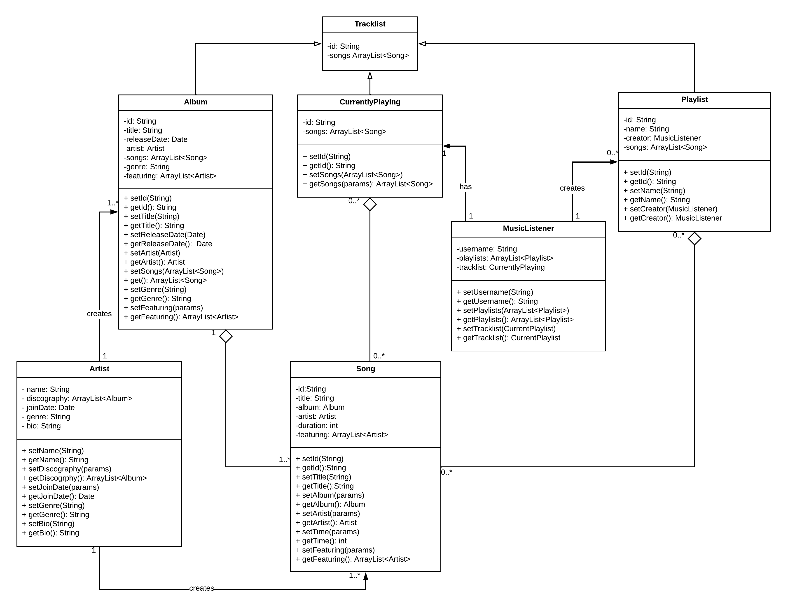

# ORDB_demo
A demonstration of the Object Relational model on Oracle and then a equivalent structuring MongoDB.
The project was based on a scenario of a database for "Jammer" a music streaming app where 'Artist' would have collections of 'Songs' and 'MusicListeners' could listen to them.

## Code
There are two database files in the project. One which is the SQL file with the ORDB structure of tables. The other is the MongoDB file with the NoSql equivallent to the ORDB.

## UML
The class diagram that serves as the template for the databases is as seen

